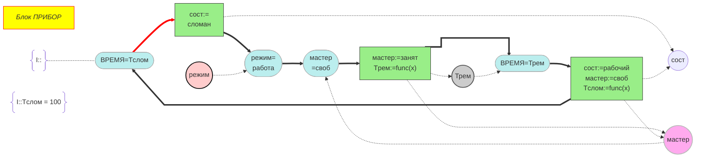
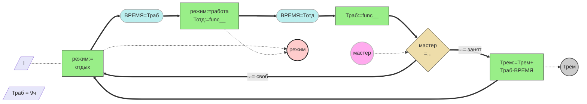
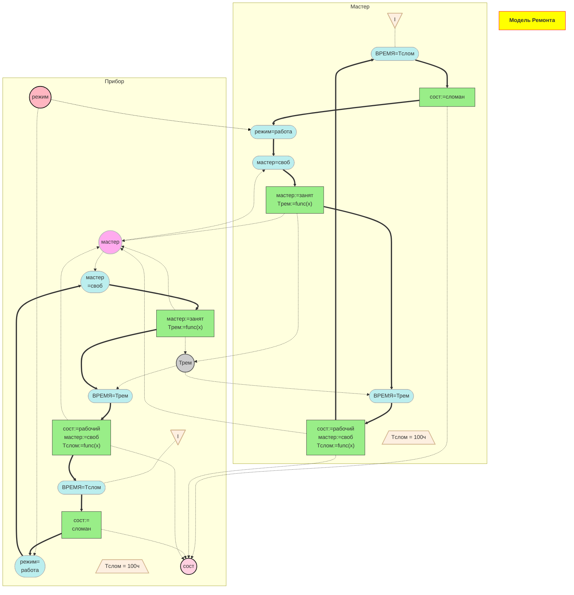

# Семинар 4

## Задание 1. Прибор



Код диаграммы:

```text
flowchart LR
    title[<em>Блок ПРИБОР</em>]
    h1(["BPEMЯ=Tслом"])==> h2["сост:=<br>сломан"]
    h2 e11@==> h3(["режим=<br>работа"]) 
    h3 ==> h4(["мастер<br>=своб"])
    h4 ==> h5["мастер:=занят<br>Tрем:=func(x)"]
    h5 e20@==> h6(["ВРЕМЯ=Трем"]) 
    h6 ==> h7["сост:=рабочий<br>мастер:=своб<br>Tслом:=func(x)"]
    h7 e10@==> h1 

    h2 -.->par3((сост))
    h7 -.->par3
    par1((режим))-.->h3
    par2((мастер))-.->h4
    h5 -.->par2
    h7 -.->par2
    h5 -.->par4((Трем))
    par4 -.-> h6
    Ini@{shape: braces, label: "I::"} -.- h1
    HTf@{shape: braces, label: "I::Tслом = 100"}

    classDef cond fill:#bee,stroke:#aaa,stroke-width:1px; 
    classDef state fill:#9e8,stroke:#333,stroke-width:1px; 
    class h5,h8,h2,h7 state; 
    class h1,h3,h4,h6 cond; 
    style title fill:yellow,stroke:red; 
    style par1 fill:#fcc,stroke:#111,stroke-width:2px; 
    style par2 fill:#fae,stroke:#bbb,stroke-width:2px; 
    style par4 fill:#ccc,stroke:#555,stroke-width:2px; 
    linkStyle 0 stroke:red,stroke-width:4px;

    e10@{ curve: linear} 
    e11@{ curve: natural} 
    e20@{ curve: stepAfter}
```

## Задание 2. Мастер



Код диаграммы:

```text
flowchart LR
    id1[/"I"/] -.- h1["режим:=<br>отдых"]
    h1 ==> h2(["ВРЕМЯ=Траб"])
    h2 ==> h3["режим:=работа<br>Тотд:=func__"]
    h3 ==> h4(["ВРЕМЯ=Тотд"])
    h4 ==> h5["Траб:=func__"]
    h5 ==> h6{"мастер<br>=..."}
    h6 == "...= занят" ==> h7["Трем:=Трем+<br>Траб-ВРЕМЯ"]
    h6 == "...= своб" ==> h1
    h7 ==> h1
    h1 -.-> par1(("режим"))
    h3 -.-> par1
    par2(("мастер")) -.-> h6
    h7 -.-> par3(("Трем"))
    id2[/"Траб = 9ч"/]

    classDef cond fill:#bee,stroke:#aaa,stroke-width:1px
    classDef state fill:#9e8,stroke:#333,stroke-width:1px
    classDef navig fill:#eda,stroke:#333,stroke-width:1px

    class h1,h3,h5,h7 state; 
    class h2,h4 cond; 
    class h6 navig;
    
    style id1 fill:#e6e6fa,stroke:#9370db,stroke-width:1px
    style id2 fill:#e6e6fa,stroke:#9370db,stroke-width:1px
    style par1 fill:#fcc,stroke:#111,stroke-width:2px; 
    style par2 fill:#fae,stroke:#bbb,stroke-width:2px; 
    style par3 fill:#ccc,stroke:#555,stroke-width:2px;
```

## Задание 3. Модель ремонта



Код диаграммы:

```text
flowchart TB
    subgraph Master["Мастер"]
        direction TB
        m_n1(["ВРЕМЯ=Tслом"])
        m_id1["I"]
        m_n2["сост:=сломан"]
        m_n3(["режим=работа"])
        m_n4(["мастер=своб"])
        m_n5["мастер:=занят<br>Tрем:=func(x)"]
        m_n6(["ВРЕМЯ=Трем"])
        m_n7["сост:=рабочий<br>мастер:=своб<br>Tслом:=func(x)"]
        m_id2["Tслом = 100ч"]
    end
    subgraph Pribor["Прибор"]
        direction TB
        p_n1(["BPEMЯ=Tслом"])
        p_id1["I"]
        p_n2["сост:=<br>сломан"]
        p_n3(["режим=<br>работа"])
        p_n4(["мастер<br>=своб"])
        p_n5["мастер:=занят<br>Tрем:=func(x)"]
        p_n6(["ВРЕМЯ=Трем"])
        p_n7["сост:=рабочий<br>мастер:=своб<br>Tслом:=func(x)"]
        p_id2["Tслом = 100ч"]
        par3(("сост"))
        par1(("режим"))
        par2(("мастер"))
        par4(("Трем"))
    end
    par1 -.-> m_n3 & p_n3
    m_n5 -.-> par2 & par4
    par2 -.-> m_n4 & p_n4
    par4 -.-> m_n6 & p_n6
    m_n2 -.-> par3
    m_n7 -.-> par3 & par2
    m_id1 -.- m_n1
    m_n1 ==> m_n2
    m_n2 ==> m_n3
    m_n3 ==> m_n4
    m_n4 ==> m_n5
    m_n5 ==> m_n6
    m_n6 ==> m_n7
    m_n7 ==> m_n1
    p_id1 -.- p_n1
    p_n1 ==> p_n2
    p_n2 ==> p_n3
    p_n3 ==> p_n4
    p_n4 ==> p_n5
    p_n5 ==> p_n6
    p_n6 ==> p_n7
    p_n7 ==> p_n1
    p_n2 -.-> par3
    p_n7 -.-> par3 & par2
    p_n5 -.-> par2 & par4
    title["Модель Ремонта"]

    m_id1@{ shape: manual-file}
    m_id2@{ shape: trap-b}
    p_id1@{ shape: manual-file}
    p_id2@{ shape: trap-b}
    
    classDef cond fill:#bee,stroke:#aaa,stroke-width:1px
    classDef state fill:#9e8,stroke:#333,stroke-width:1px
    classDef init fill:#fdefe0,stroke:#d2b48c,stroke-width:2px
    
    class m_n1,m_n3,m_n4,m_n6,p_n1,p_n3,p_n4,p_n6 cond
    class m_n2,m_n5,m_n7,p_n2,p_n5,p_n7 state
    class m_id1,m_id2,p_id1,p_id2 init
    
    style par1 fill:#ffb6c1,stroke:#111,stroke-width:2px
    style par2 fill:#fae,stroke:#bbb,stroke-width:2px
    style par3 fill:#ffd0e0,stroke:#111,stroke-width:2px
    style par4 fill:#ccc,stroke:#555,stroke-width:2px
    style title fill:yellow,stroke:red,font-weight:bold
    
    linkStyle 0 stroke:#000000,fill:none

    click par2 href "https://iu5.bmstu.ru" "переход для Мастера" _blank
    click par4 href "https://www.mos.ru/news/item/156079073" "переход для Трем" _blank
```
